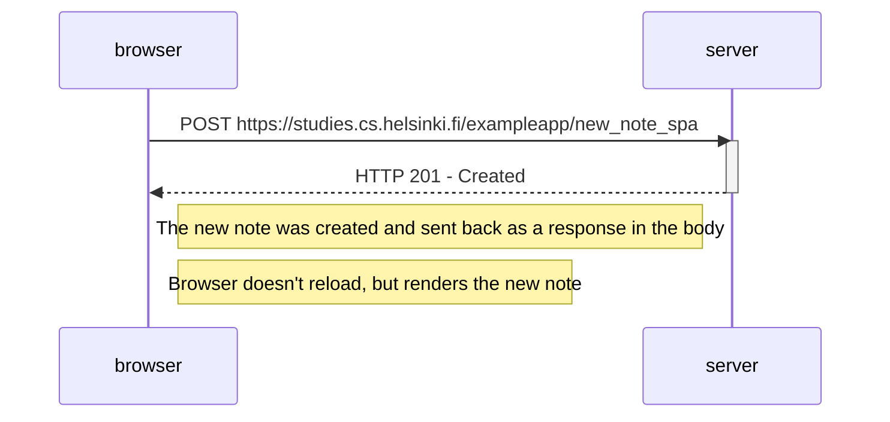

```mermaid
sequenceDiagram
    participant browser
    participant server

    browser->>server: POST https://studies.cs.helsinki.fi/exampleapp/new_note_spa
    activate server
    server-->>browser: HTTP 201 - Created
    deactivate server

    Note left of server: The new note was created and sent back as a response in the body
    Note right of browser: Browser doesn't reload, but renders the new note
```
